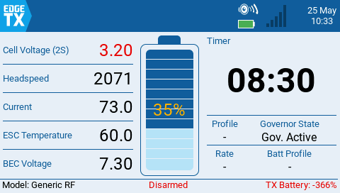
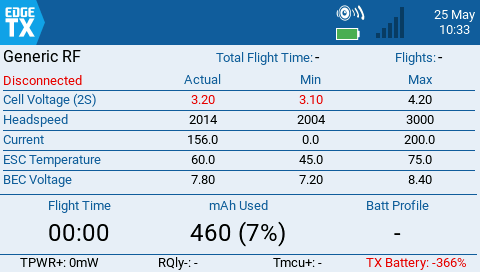
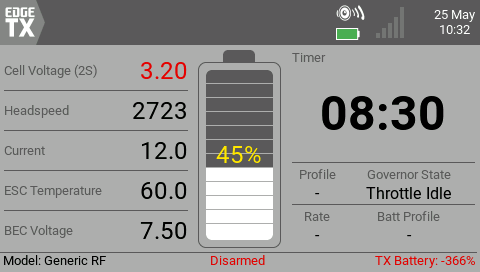
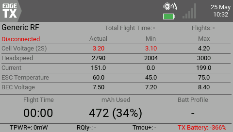

# HeliDash
EdgeTX telemetry widget for RC helicopters running Rotorflight.

HeliDash is focused on a clean in-flight dashboard for helicopter-specific telemetry: headspeed, battery and cell data, current draw, BEC voltage, ESC and MCU temperatures, governor state, profile/rate information, and flight statistics, with optional audio and haptic battery alerts.

> Current line: `2026.05`
>
> Repository note: this repository still uses the historical name `HeliWidget`, but the widget itself is `HeliDash` in `/WIDGETS/HeliDash`.

## Highlights
- Rotorflight-focused helicopter telemetry layout
- Live flight dashboard plus flight statistics view
- Headspeed, governor state, profile/rate, and battery-profile visibility
- Selectable cell-voltage or battery-voltage display, with ESC temperature shown in both flight and statistics views
- Battery and cell monitoring with audio/haptic low-battery callouts
- EdgeTX simulator-friendly development and layout testing
- RFTools-backed RF2 integration for richer Rotorflight data and flight statistics

## Requirements
- **EdgeTX**: tested on 3.0 nightlies and expected to work on 2.11+ era builds
- **Rotorflight** running on the flight controller
- **Rotorflight Lua scripts**, including the **RFTools widget**, so the RF2 APIs used by HeliDash are available
  - Setup instructions: [Rotorflight Lua Scripts](https://github.com/rotorflight/rotorflight-lua-scripts)

RFTools is not only used for RF-backed data. HeliDash also relies on the RFTools/RF2 connection state to switch automatically between the Flight UI and the Flight Statistics UI.

If RFTools becomes available after HeliDash is already running, HeliDash will attach to it on the next service cycle and pick up the current RF state.

Without RFTools, HeliDash can still show basic direct telemetry, but RF-backed data, automatic state-driven view switching, and battery-profile integration will be limited or unavailable.

## Minimum Telemetry Requirements
Designed for Rotorflight with the following minimum telemetry sensors configured:
- Main battery and power data: `Vbat`, `Curr`, `Capa`, `Bat%`, `Cel#`, `Vcel`, `Vbec`
- ESC data: `Tesc`
- Helicopter-specific data: `Hspd`, `Gov`
- Flight-controller data: `ARM`, `ARMD`, `PID#`, `RTE#`, `BAT#`, `Tmcu`

```text
set telemetry_sensors = 3,4,5,6,7,8,43,50,52,60,90,91,93,95,96,97,0,0,0,0,0,0,0,0,0,0,0,0,0,0,0,0,0,0,0,0,0,0,0,0
```

## Installation
1. Copy the `WIDGETS/HeliDash` folder to the SD card.
2. Install and configure the Rotorflight Lua scripts, including the `RFTools` widget.
3. Configure the required telemetry sensors on the flight controller.
4. Add `HeliDash` as a widget on the target model screen in EdgeTX.
5. Review the widget options after first load.

## Widget Options
- `Timer`: which EdgeTX timer to display
- `BGFilled`: fill the widget background color
- `FuelMin`: minimum battery percentage for low-battery warning
- `CalloutInt`: battery callout interval in seconds, from 1 to 60
- `Haptic`: vibrate on battery callouts
- `StatsViewMode`: when to show the statistics page: `Never`, `On disarmed`, or `On disconnected`
- `VoltageDisplay`: show voltage as `Cell voltage` or `Battery voltage`

## Preview
### Default EdgeTX Theme



### Custom Theme



## Support & Disclaimer
- This is a personal hobby project shared freely with the community.
- Provided as-is without warranty or guaranteed support.
- Issues and pull requests are welcome, but responses may be slow.
- **Use at your own risk**. Always verify critical telemetry data and keep safe operating practices.
